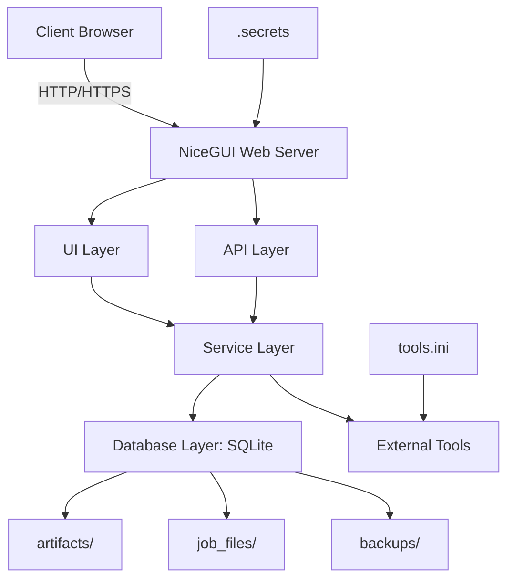

# Accessibility Project Management

A **NiceGUI-based local web application** for accessibility production teams. It manages braille, large print, eBraille, EPUB3/DAISY, tactile graphics, and 3-D printing workflows, with student records, file ingestion, metadata management, QA tooling, inventory, backups, and an API surface—all backed by SQLite.

---

## 📌 Project Status

This project is currently an **alpha-stage operational prototype** with a modular NiceGUI architecture, SQLite-backed persistence, and a focus on accessibility workflows for educational and production environments.

---

## ✨ Features

### Production Workflow Tracking
- **Braille Jobs**: Transcription, formatting, and embossing workflows
- **Large Print Jobs**: Scaling, formatting, and printing workflows
- **eBraille Jobs**: Digital braille file generation and distribution
- **EPUB3/DAISY Jobs**: Accessible e-book production and validation
- **Tactile Graphics**: Thermoform, hand-tooled, and embossed figure tracking
- **3-D Print Jobs**: Filament usage, print tracking, and job management

Each job supports step completion, reversion, delivery capture, event logging, Dublin Core/eBraille/METS/PREMIS metadata, step-level file attachments, and student record linkage.

### File Ingestion & Preservation
- Drag-and-drop or path-based ingestion
- Automatic SHA-256 checksums and PREMIS-style event logging
- File-use classification and provenance tracking
- Organized storage in `artifacts/<Project Title>/...`

### Search & Reporting
- Global search across jobs, metadata, students, files, and events
- Exact checksum matching for file identification
- Filterable reports by school, grade, type, status, and date range
- CSV export for all reports

### Inventory Management
- Filament tracking (brand, color, type, diameter, quantity, cost, supplier)
- Braille paper management (type, size, label, quantity, supplier)
- Electronics inventory (configurable categories for components)
- Low-stock warnings and transaction history

### QA & Automation
- Integration with DAISY Ace, EPUBCheck, Liblouis, BRLTTY, Pandoc, DAISY Pipeline 2
- QA run storage in database, linked to jobs

### Provenance & Lineage
- Full event history for all operations
- Mermaid-based lineage viewer for file-to-job relationships

### Administration
- Manage material categories, workflow steps, printers, embossers, metadata options
- Backup configuration and retention policies
- User and role management (RBAC)

### API
- RESTful API mounted at `/api`
- Optional authentication via API keys

---

## 🏗️ Architecture

APM is built on a **modular, service-oriented architecture**:



**Technology Stack:**
- **UI Framework**: [NiceGUI](https://nicegui.io/)
- **Database**: SQLite with WAL journaling
- **Language**: Python 3.12+
- **Package Manager**: [uv](https://github.com/astral-sh/uv)
- **Encryption**: Fernet (cryptography library)
- **Authentication**: PBKDF2-HMAC-SHA-256

---

## 🛠️ Installation

### Prerequisites
- Python 3.12 or higher
- [uv](https://github.com/astral-sh/uv) (recommended)

### Quick Start
```bash
# 1. Clone the repository
git clone https://github.com/mrhunsaker/AccessibilityProjectManagement.git
cd AccessibilityProjectManagement

# 2. Install ALL dependencies (app + docs) with ONE command
uv sync

# 3. Create .secrets file (see Secrets & Authentication below)
touch .secrets
chmod 600 .secrets

# 4. Run the application
uv run AccessMan
```
Open your browser to [http://localhost:8765](http://localhost:8765)

---
## 📚 Documentation

### Generating Documentation

This project uses **MkDocs** with the **Material theme** for professional documentation. All documentation source files are in the `docs/` directory.

#### Install Documentation Dependencies
All documentation dependencies are included in `pyproject.toml`. Simply run:
```bash
uv sync
```
This installs **both** application and documentation dependencies in one step.

#### Local Preview
To preview documentation locally:
```bash
uv run mkdocs serve
```
Then open [http://localhost:8000](http://localhost:8000) in your browser. The site will auto-refresh as you edit files.

#### Build Static Site
To generate the static documentation site:
```bash
uv run mkdocs build
```
Output will be in the `site/` directory.

#### Deploy to GitHub Pages
Documentation is automatically deployed to GitHub Pages via the workflow in `.github/workflows/docs.yml`. To trigger a manual build:
1. Push changes to `main` branch
2. The GitHub Actions workflow will automatically build and deploy

**Access deployed docs at:** [https://mrhunsaker.github.io/AccessibilityProjectManagement/](https://mrhunsaker.github.io/AccessibilityProjectManagement/)

---
## 🔐 Secrets & Authentication

### `.secrets` File
Create a `.secrets` file in the **repository root** (not inside `accessibility_mgr/`). **Never commit this file.**

**Required Secrets:**
```ini
# Generate with: python -c "import secrets; print('STORAGE_SECRET=' + secrets.token_urlsafe(32))"
STORAGE_SECRET=your_storage_secret_here

# Generate with: python -c "import hashlib,os,base64; salt=os.urandom(16); dk=hashlib.pbkdf2_hmac('sha256',b'your_password',salt,260000); print('ACCESSMAN_PASSWORD_HASH=' + base64.b64encode(salt+dk).decode())"
ACCESSMAN_PASSWORD_HASH=your_pbkdf2_password_hash_here

# Generate with: python -c "from cryptography.fernet import Fernet; print('ACCESSMAN_VAULT_KEY=' + Fernet.generate_key().decode())"
ACCESSMAN_VAULT_KEY=your_fernet_key_here
```

**Optional Secrets:**
```ini
ACCESSMAN_API_AUTH_REQUIRED=1
ACCESSMAN_API_KEY=your_api_key_here
ACCESSMAN_DB_PATH=/path/to/your/database.db
ACCESSMAN_BACKUP_DIR=/path/to/backups
ACCESSMAN_BACKUP_RETENTION=30
ACCESSMAN_LOG_LEVEL=INFO
```

---
## 🌍 Environment Variables

| Variable | Required | Default | Description |
|----------|----------|---------|-------------|
| `STORAGE_SECRET` | **Yes** | - | NiceGUI session encryption key |
| `ACCESSMAN_PASSWORD_HASH` | **Yes** | - | PBKDF2 password hash for login |
| `ACCESSMAN_VAULT_KEY` | **Yes** | - | Fernet key for encrypted secrets |
| `ACCESSMAN_API_AUTH_REQUIRED` | No | `0` | Enable API authentication (`1` = enabled) |
| `ACCESSMAN_API_KEY` | No | - | API key for authentication |
| `ACCESSMAN_DB_PATH` | No | User data directory | Path to SQLite database |
| `ACCESSMAN_UNPROTECTED` | No | `0` | **Danger:** Disable authentication for development (`1` = disabled) |

---
## 📂 External Tool Configuration

Copy `tools.ini.example` to `tools.ini` and configure paths:
```ini
[tools]
ace = /usr/local/bin/ace
epubcheck = /usr/local/bin/epubcheck
pipeline = /opt/daisy-pipeline/bin/pipeline2
liblouis = /usr/bin/lou_translate

[paths]
extra =
    /opt/daisy-pipeline/bin
    /usr/local/share/npm/bin
```

---
## 🚀 Usage

### Starting the Application
```bash
uv run AccessMan
```
The app will load secrets, initialize the database, start the backup service, and launch on [http://localhost:8765](http://localhost:8765).

### Logging In
Enter the password configured in `ACCESSMAN_PASSWORD_HASH`.

### Dashboard
Overview of active jobs, low-stock alerts, and recent activity.

---
## 🔒 Security

- **Authentication**: PBKDF2-HMAC-SHA-256 with 260,000 iterations
- **Secret Management**: Fernet encryption (AES-128-CBC with PKCS7 padding)
- **RBAC**: Tenant-based role management

---
## 📦 Dependencies

All dependencies are managed via `uv` in `pyproject.toml`:

**Core Dependencies:**
- `nicegui>=1.4.0` – Web UI framework
- `sqlalchemy>=2.0.0` – Database ORM
- `cryptography>=42.0.0` – Encryption and hashing

**Development Dependencies:**
- `pytest>=7.0`
- `pytest-asyncio>=0.23`
- `ruff>=0.4.0`
- `mypy>=1.9`
- `pyinstaller>=6.0.0` – For building standalone executables

**Documentation Dependencies:**
- `mkdocs>=1.6.0`
- `mkdocs-material>=9.5.0`
- `mkdocs-autorefs>=1.4.0`
- `mkdocstrings[python]>=0.25.0`
- `pymdown-extensions>=10.21.3`
- `mkdocs-git-revision-date-localized-plugin>=1.2.0`

Install all with: **`uv sync`**

---
## 🧪 Development

### Running Tests
```bash
uv run pytest
```

### Linting
```bash
uv run ruff check accessibility_mgr/
```

### Type Checking
```bash
uv run mypy accessibility_mgr/
```

### Seeding the Database
```bash
uv run AccessMan-seed
```

---
## 📦 Deployment

### Building Standalone Executables with PyInstaller

APM can be built as standalone executables for **Linux, Windows, and macOS** using PyInstaller. All builds enforce **browser-only mode** (no native NiceGUI windows).

#### **Prerequisites**
- PyInstaller installed via `uv sync` (included in `pyproject.toml` dev dependencies)
- For smaller binaries: [UPX](https://upx.github.io/) (optional)

#### **Build Commands**

| Platform | Command | Output Location | Run Command |
|----------|---------|-----------------|-------------|
| **Linux** | `./build_linux.sh` | `dist/linux/AccessMan` | `./dist/linux/AccessMan` |
| **Windows** | `build_windows.bat` | `dist\windows\AccessMan.exe` | `dist\windows\AccessMan.exe` |
| **macOS** | `./build_macos.sh` | `dist/macos/AccessMan` | `./dist/macos/AccessMan` |

#### **Build Notes**
- All builds include:
  - All Python dependencies
  - Application resources (icons, etc.)
  - Database schemas
- **Browser-Only**: All builds enforce `NICEGUI_BROWSER_ONLY=1` to ensure the app **only** opens in the default web browser
- **First Build**: Initial build may take several minutes
- **Testing**: Always test built binaries on a clean machine without Python installed

---

### Running with Podman

APM can be deployed using **Podman** (rootless container runtime). This is the recommended method for production deployments.

#### **Prerequisites**
- [Podman](https://podman.io/) installed
- [Podman Compose](https://github.com/containers/podman-compose) installed

#### **Quick Start**
```bash
# 1. Build the image
podman build -t accessibility-manager -f Containerfile .

# 2. Start the container
podman-compose up -d
```
Access the application at: [http://localhost:8765](http://localhost:8765)

#### **Manual Run**
```bash
# Create data directory
mkdir -p data/{artifacts,job_files,prints_files,backups}

# Run the container
podman run -d \
  --name accessibility-manager \
  -p 8765:8765 \
  -v ./data:/data \
  -v ./.secrets:/app/.secrets:ro \
  -v ./tools.ini:/app/tools.ini:ro \
  accessibility-manager
```

#### **Configuration Files**
| File | Purpose | Required | Mount Point |
|------|---------|----------|-------------|
| `.secrets` | Secrets (passwords, API keys, etc.) | **Yes** | `/app/.secrets` |
| `tools.ini` | External tool configurations | No | `/app/tools.ini` |
| `data/` | Persistent data (database, backups, etc.) | **Yes** | `/data` |

#### **Management Commands**
| Command | Description |
|---------|-------------|
| `podman-compose up -d` | Start the application |
| `podman-compose down` | Stop the application |
| `podman-compose logs -f` | View logs |
| `podman-compose pull` | Pull latest image |
| `podman-compose up -d --build` | Rebuild and restart |

#### **Updates**
To update to the latest version:
```bash
podman-compose down
git pull origin main
podman-compose up -d --build
```

---
## 📜 License

MIT License – see [LICENSE](LICENSE) for details.

---
## 🤝 Contributing

Contributions welcome! Open an issue or submit a pull request.

---
## 🆘 Support

- **Issues**: [GitHub Issues](https://github.com/mrhunsaker/AccessibilityProjectManagement/issues)
- **Discussions**: [GitHub Discussions](https://github.com/mrhunsaker/AccessibilityProjectManagement/discussions)
- **Email**: [github@mail.hunsakerweb.com](mailto:github@mail.hunsakerweb.com)

---
## 🏷️ Metadata

- **Author**: Michael Ryan Hunsaker, M.Ed., Ph.D.
- **Version**: 2026.6.9
- **Python Version**: ≥3.12
- **Keywords**: `braille`, `3d-printing`, `inventory`, `nicegui`, `project-management`, `accessibility`
