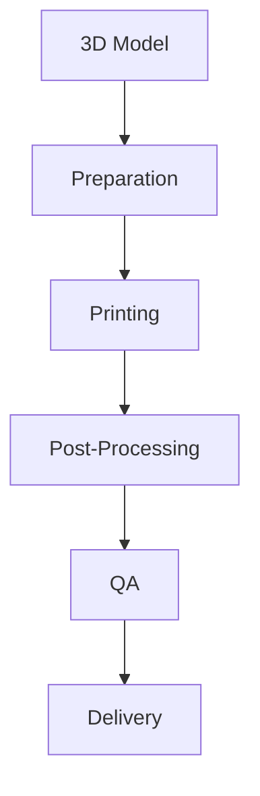

# 3-D Print Workflow

**Managing 3D printing for accessibility aids and tactile models.**

---

## 📋 Workflow Overview

---

## 📋 Detailed Steps

### 1. Model Acquisition/Creation
- **Purpose**: Obtain or create 3D model
- **Sources**:
  - Pre-made models (Thingiverse, etc.)
  - Custom designs
  - Scanned objects
- **File Formats**: STL, OBJ, 3MF

### 2. Preparation
- **Purpose**: Prepare model for printing
- **Tasks**:
  - Scale to appropriate size
  - Orient for optimal printing
  - Add supports if needed
  - Slice for printer
- **Tools**: [TODO: Add your slicing software here]

### 3. Printing
- **Purpose**: Produce physical object
- **Tasks**:
  - Select printer
  - Load filament
  - Configure printer settings
  - Start print job
- **Equipment**: [TODO: Add your 3D printers here]

### 4. Post-Processing
- **Purpose**: Finish the printed object
- **Tasks**:
  - Remove supports
  - Sand rough edges
  - Clean up surfaces
  - Add any additional components

### 5. Quality Assurance
- **Purpose**: Verify print quality
- **Checks**:
  - Dimensional accuracy
  - Surface quality
  - Structural integrity
  - Fit with other components

### 6. Delivery
- **Purpose**: Send to recipient
- **Tasks**:
  - Package securely
  - Include care instructions
  - Update filament inventory

---
## 🛠️ Equipment & Materials

### 3D Printers
| Printer | Filament Type | Max Build Volume | Notes |
|---------|---------------|------------------|-------|
| [TODO] | [TODO] | [TODO] | [TODO] |

### Filament Inventory
| Filament | Color | Diameter | Quantity | Cost/kg | Supplier |
|----------|-------|----------|----------|---------|----------|
| [TODO] | [TODO] | [TODO] | [TODO] | [TODO] | [TODO] |

---
## 📊 Best Practices

### Design Guidelines
- [TODO: Add your design best practices]

### Printing Tips
- [TODO: Add your printing best practices]

---
## 🔗 Related Workflows

- [Tactile Graphics Workflow](tactile-graphics.md) - For 2D tactile elements
- [Braille Workflow](braille.md) - For accompanying text
- [Inventory Management](../inventory.md) - For filament tracking
