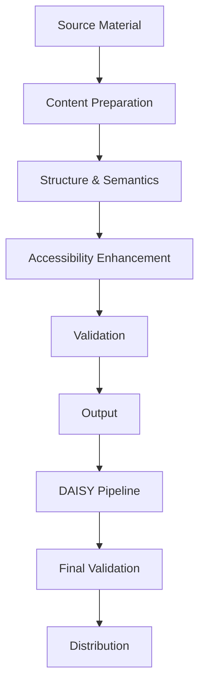

# EPUB3/DAISY Workflow

**Creating accessible e-books and digital talking books.**

---

## 📋 Workflow Overview



---

## 📋 Detailed Steps

### 1. Source Acquisition
- **Purpose**: Gather source materials
- **Tasks**:
  - Collect all content (text, images, audio)
  - Verify copyright permissions
  - Check for existing accessible versions
- **Supported Source Types**:
  - Word documents
  - PDFs
  - HTML
  - Existing EPUBs
  - Scanned documents (OCR required)

### 2. Content Preparation
- **Purpose**: Clean and structure content
- **Tasks**:
  - Convert to HTML or XHTML
  - Clean up formatting
  - Extract images
  - Organize into logical structure
- **Tools**: Pandoc, Sigil, Oxygen XML Editor

### 3. Structure & Semantics
- **Purpose**: Add proper semantic structure
- **Tasks**:
  - Define document structure (headings, paragraphs, lists)
  - Add ARIA roles and properties
  - Create navigation document (NCX)
  - Define table of contents
- **Key Elements**:
  - `<h1>`-`<h6>` for headings
  - `<p>` for paragraphs
  - `<ul>`, `<ol>`, `<dl>` for lists
  - `<table>` for tables
  - `` with `alt` attributes

### 4. Accessibility Enhancement
- **Purpose**: Make content accessible
- **Tasks**:
  - Add alt text for images
  - Create extended descriptions for complex images
  - Add captions/transcripts for audio/video
  - Ensure color contrast
  - Add ARIA attributes
  - Define reading order
- **WCAG Requirements**:
  - **Images**: Alt text for all non-decorative images
  - **Audio/Video**: Captions and transcripts
  - **Color**: Minimum 4.5:1 contrast ratio
  - **Navigation**: Logical tab order
  - **Language**: Define document language

### 5. Styling
- **Purpose**: Apply visual styling
- **Tasks**:
  - Create CSS stylesheet
  - Define typography
  - Set up page layouts
  - Configure responsive design
- **Best Practices**:
  - Use relative units (em, rem, %)
  - Avoid fixed positioning
  - Ensure text remains readable when enlarged
  - Provide print styles

### 6. Metadata
- **Purpose**: Add descriptive metadata
- **Tasks**:
  - Add Dublin Core metadata
  - Define accessibility metadata
  - Add ONIX metadata (for commercial)
- **Required Metadata**:
  - Title
  - Language
  - Creator/Author
  - Publisher
  - Date
  - Identifier (ISBN, DOI, etc.)
  - Accessibility features

### 7. Validation
- **Purpose**: Check for errors
- **Tasks**:
  - Run EPUBCheck
  - Validate with DAISY Ace
  - Manual review
- **Tools**:
  - [EPUBCheck](https://github.com/w3c/epubcheck)
  - [DAISY Ace](https://daisy.org/activities/software/ace/)

### 8. DAISY Pipeline Processing
- **Purpose**: Convert to DAISY format
- **Tasks**:
  - Run through DAISY Pipeline 2
  - Select appropriate transformation
  - Configure output options
- **Common Transformations**:
  - EPUB3 to DAISY 3
  - EPUB3 to DAISY 2.02
  - HTML to DAISY
  - DTBook to DAISY

### 9. Final Validation
- **Purpose**: Ensure DAISY compliance
- **Tasks**:
  - Validate with DAISY Ace
  - Test with screen readers
  - Verify navigation
- **DAISY Requirements**:
  - Proper structure
  - Navigation works
  - Audio sync (if applicable)
  - Text-only version available

### 10. Distribution
- **Purpose**: Deliver to users
- **Tasks**:
  - Package files
  - Create distribution manifest
  - Upload to delivery system
- **Distribution Formats**:
  - ZIP archive
  - Direct download
  - CD/DVD
  - Online repository

---
## 🛠️ Tools & Software

### Core Tools

| Tool | Purpose | Platform | License |
|------|---------|----------|---------|
| DAISY Pipeline 2 | Conversion engine | Cross-platform | Apache 2.0 |
| EPUBCheck | EPUB validation | Cross-platform | BSD |
| DAISY Ace | Accessibility checker | Web-based | Open Source |
| Sigil | EPUB editor | Windows, macOS, Linux | GPL |
| Calibre | E-book management | Cross-platform | GPL |
| Pandoc | Document conversion | Cross-platform | GPL |

### Validation Tools

| Tool | Checks For | Output |
|------|------------|--------|
| EPUBCheck | EPUB compliance | Pass/Fail report |
| DAISY Ace | Accessibility | Detailed report |
| NVDA | Screen reader compatibility | Audio feedback |
| JAWS | Screen reader compatibility | Audio feedback |
| VoiceOver | Screen reader compatibility | Audio feedback |

---
## 📊 Accessibility Features

### Required Features

| Feature | Description | Implementation |
|---------|-------------|----------------|
| Alt Text | Text descriptions for images | `` |
| Extended Descriptions | Long descriptions for complex images | `<figcaption>` or separate file |
| Captions | Text for audio/video | `<track>` element |
| Transcripts | Full text of audio/video | Separate text file |
| Reading Order | Logical content sequence | CSS `order` property |
| Language | Content language | `lang` attribute |
| Semantic Structure | Proper use of HTML elements | `<header>`, `<nav>`, `<main>`, etc. |
| Navigation | Easy content navigation | TOC, landmarks, page list |
| Text Alternatives | For non-text content | Alt text, captions, transcripts |
| Adaptable | Content can be presented differently | CSS flexibility |
| Distinguishable | Easy to see and hear | Color contrast, clear audio |

### Advanced Features

| Feature | Description | Implementation |
|---------|-------------|----------------|
| Audio Synchronization | Text highlighted as audio plays | SMIL or WebVTT |
| Sign Language | Video of sign language interpretation | `<video>` with sign language track |
| Tactile Graphics | Descriptions for tactile images | Separate DTB volume |
| Braille | Braille version of text | Separate BRF file |
| Large Print | Larger text version | CSS media queries |
| Customizable | User can adjust display | CSS custom properties |

---
## 📁 File Structure

```
my-epub/
├── META-INF/
│   └── container.xml
├── OEBPS/
│   ├── content.opf
│   ├── toc.ncx
│   ├── toc.xhtml
│   ├── chapter1.xhtml
│   ├── chapter2.xhtml
│   ├── images/
│   │   ├── image1.png
│   │   └── image2.jpg
│   ├── styles/
│   │   └── style.css
│   └── audio/
│       └── narration.mp3
└── mimetype
```

---
## 🔗 Related Workflows

- [Braille Workflow](braille.md) - For braille versions
- [Large Print Workflow](large-print.md) - For large print versions
- [Tactile Graphics Workflow](tactile-graphics.md) - For tactile images


