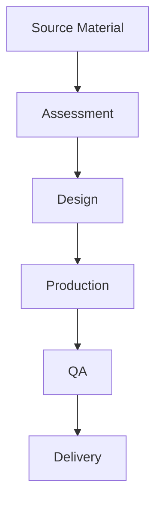

# Tactile Graphics Workflow

**Creating and managing tactile graphics for blind and low-vision students.**

---

## 📋 Workflow Overview

---

## 📋 Detailed Steps

### 1. Assessment
- **Purpose**: Determine tactile graphics requirements
- **Tasks**:
  - Review source images/diagrams
  - Consult with student/teacher
  - Determine complexity level
- **Considerations**:
  - Student's tactile literacy
  - Educational context
  - Available production methods

### 2. Design
- **Purpose**: Create tactile-ready design
- **Tasks**:
  - Simplify complex images
  - Add braille labels
  - Define textures and layers
- **Tools**: [TODO: Add your tools here]

### 3. Production
- **Purpose**: Create physical tactile graphic
- **Methods**:
  - Thermoform
  - Embossing
  - Hand-tooled
  - 3D printed
- **Equipment**: [TODO: Add your equipment here]

### 4. Quality Assurance
- **Purpose**: Verify accuracy and usability
- **Tasks**:
  - Tactile review
  - Student testing
  - Durability check

### 5. Delivery
- **Purpose**: Send to student
- **Tasks**:
  - Package with braille key
  - Include instructions
  - Update inventory

---
## 🛠️ Tools & Equipment

| Tool | Purpose | Notes |
|------|---------|-------|
| [TODO] | [TODO] | [TODO] |

---
## 📊 Best Practices

- [TODO: Add your best practices here]

---
## 🔗 Related Workflows

- [Braille Workflow](braille.md) - For accompanying text
- [3-D Print Workflow](3d-print.md) - For 3D tactile elements
