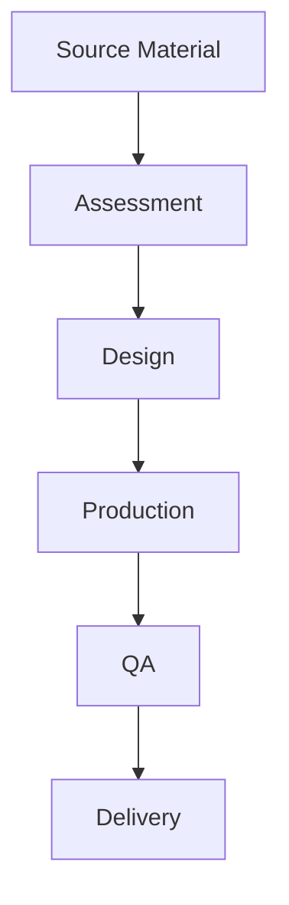

# Tactile Graphics Workflow

**Creating and managing tactile graphics for blind and low-vision students.**

---

## Workflow Overview

```mermaid
graph TD
    A[Source Material] --> B[Assessment]
    B --> C[Design]
    C --> D[Production]
    D --> E[QA]
    E --> F[Delivery]
```

---

## Detailed Steps

### 1. Assessment
- **Purpose**: Determine tactile graphics requirements
- **Tasks**:
  - Review source images/diagrams
  - Consult with student/teacher
  - Determine complexity level
- **Considerations**:
  - Student's tactile literacy
  - Educational context
  - Available production methods

### 2. Design
- **Purpose**: Create tactile-ready design
- **Tasks**:
  - Simplify complex images
  - Add braille labels
  - Define textures and layers

### 3. Production
- **Purpose**: Create physical tactile graphic
- **Methods**:
  - Thermoform
  - Embossing
  - Hand-tooled
  - 3D printed

### 4. Quality Assurance
- **Purpose**: Verify accuracy and usability
- **Tasks**:
  - Tactile review
  - Student testing
  - Durability check

### 5. Delivery
- **Purpose**: Send to student
- **Tasks**:
  - Package with braille key
  - Include instructions
  - Update inventory

---

## Best Practices

- Simplify complex images to essential elements
- Use consistent textures to represent different concepts
- Include braille labels for all important features
- Test with students before final production
- Document design decisions for future reference

---

## Related Workflows

- [Braille Workflow](braille.md) - For accompanying text
- [3-D Print Workflow](3d-print.md) - For 3D tactile elements
